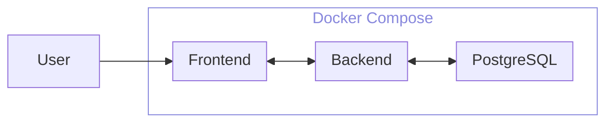

# このアプリはなにか？

Task管理するためのwebアプリケーション。

# モチベーション

- frontendの勉強したい
- どうせならwebアプリを作りたい
- ある程度役に立ちそうなものがいい

# 全体の構成

# 苦労 / 詰まったところ

- hogehoge

## 最初にやっておけばよかったこと

- 

# 今現在の課題

- フロントのデザインがコレジャナイ感ある...

# 今後やってみたいこと

- ログインシステムの追加
- Taskをまとめる "Project" 単位の導入
- kebenetesの導入